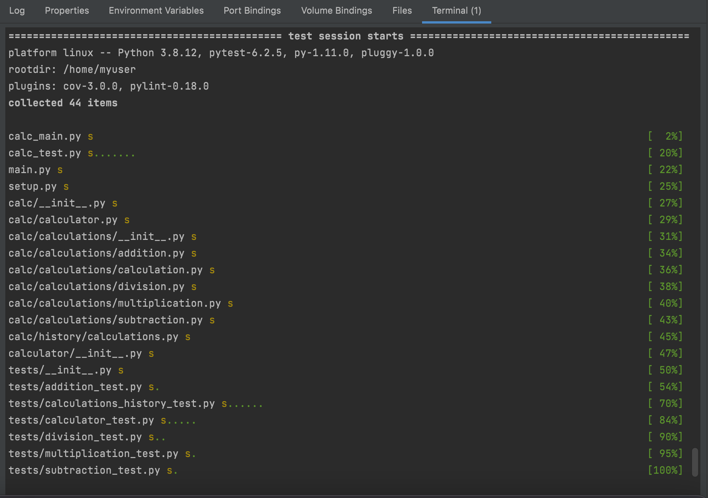
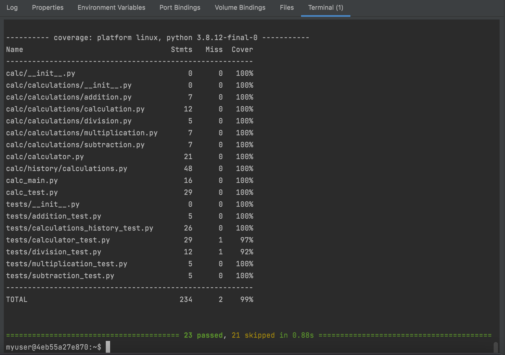
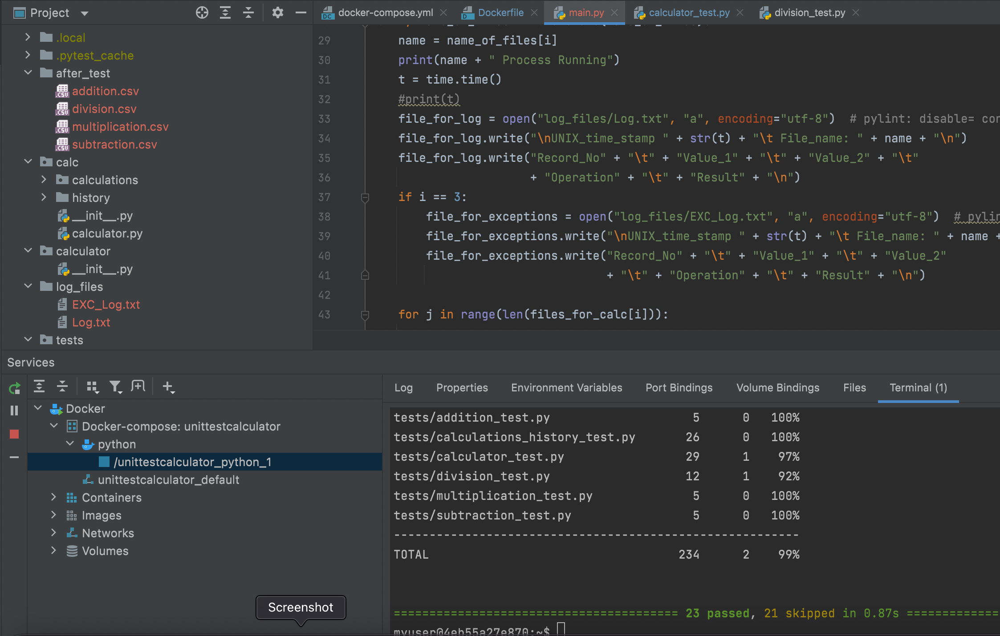
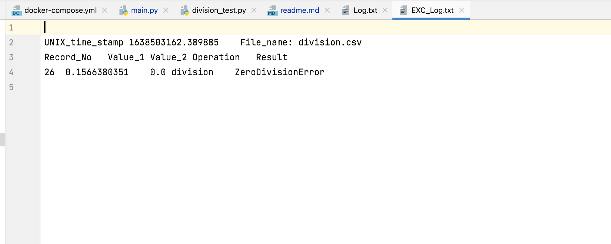
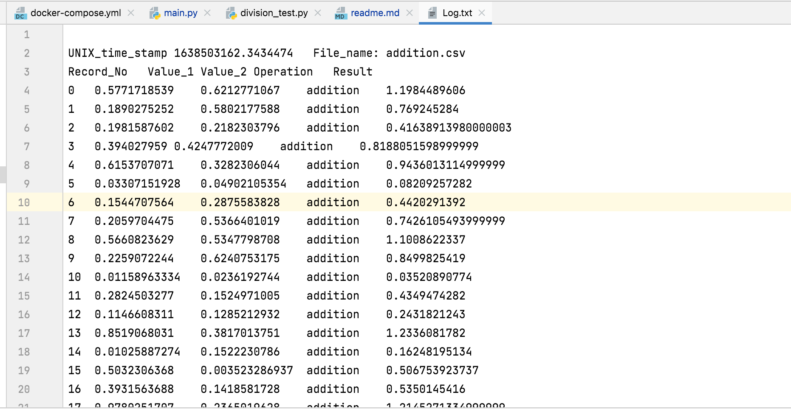

# My Calculator Program

### added refactored versions travis badge.

## calc_part5 : 
This part of calculator reads from csv files, 
performs operations and outputs the result to log file.
 I have attached screenshots for the pylint, cov report, 
after_test and log_files

